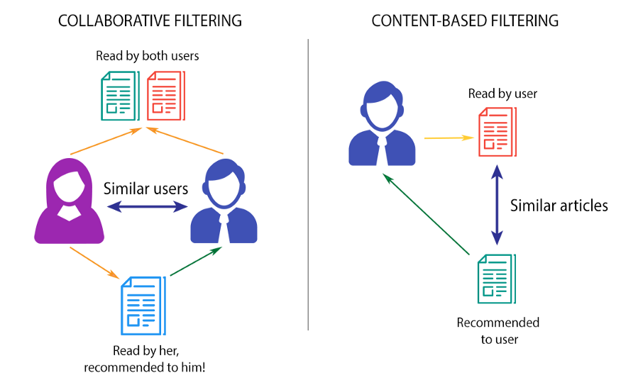

# Movie Recommendation System

## Project Overview

This project aims to implement a movie recommendation system using various preprocessing steps, model building, and creating a user interface.
This project implements a movie and a user recommendation system using collaborative filtering. The system is designed to suggest movies to users based on their historical movie ratings and similarities with other users.
Recommender systems are built on MovieLens dataset with 100,000 movie ratings. These Recommender systems were built using Pandas operations and by fitting KNN to suggest movies for the users based on similar users.


## Table of Contents

- [Introduction](#introduction)
- [Requirements](#requirements)
- [Installation](#installation)
- [Architecture](#architecture)
- [Model](#model)
- [Unittest and Github Action](#unittest-and-github-action)
- [API Usage](#api-usage)
- [License](#license)

## Introduction

This recommendation system leverages collaborative filtering, a popular approach in recommender systems, to provide personalized movie suggestions to users. Collaborative filtering works by identifying users who have similar movie preferences and recommending movies that these similar users have rated highly.

## Requirements

- Python 3.x
- pandas
- numpy
- scipy
- scikit-learn
- joblib
- fastapi
- uvicorn[standard]

## Installation

1. Clone the repository:
```
git clone https://github.com/mlops-recofilm/recofilm.git
cd recofilm
```

## Architecture 

```
.
├── Images
│   └── reco_diagram.png
├── __init__.py
├── api
│   ├── Dockerfile
│   ├── __init__.py
│   ├── api.py
│   ├── api_requirements.txt
│   └── api_utils
│       ├── __init__.py
│       └── utils.py
├── docker-compose.yml
├── docker_volume
│   ├── data
│   │   ├── data_api.csv
│   │   ├── final_False_0.3_50_5_False.csv
│   │   └── merged_False_0.3_50_5_False.csv
│   ├── inputs
│   │   ├── README.txt
│   │   ├── genome-scores.csv
│   │   ├── genome-tags.csv
│   │   ├── links.csv
│   │   ├── movies.csv
│   │   ├── ratings.csv
│   │   └── tags.csv
│   ├── model_folder
│   │   ├── movie_model.joblib
│   │   └── user_model.joblib
│   ├── outputs
│   │   ├── mapping_username_user_id.json
│   │   ├── next_new_userid
│   │   ├── predictions_history.json
│   │   └── rapport.txt
│   └── unittest
│       ├── kpi_movie_model
│       │   ├── dict_prediction_comparaison.pkl
│       │   └── dict_stability.pkl
│       └── kpi_user_model
│           ├── dict_prediction_comparaison.pkl
│           └── dict_stability.pkl
├── model_job
│   ├── Dockerfile
│   ├── __init__.py
│   ├── model
│   │   ├── __init__.py
│   │   ├── movie_model.py
│   │   ├── user_model.py
│   │   └── utils.py
│   ├── model_requirements.txt
│   ├── model_utils.py
│   └── training_pipeline.py
├── preprocessing_job
│   ├── Dockerfile
│   ├── __init__.py
│   ├── check_data.py
│   ├── create_data.py
│   ├── main.py
│   └── preprocessing_requirements.txt
├── readme.md
├── requirements.txt
├── streamlit_job
│   ├── Dockerfile
│   ├── __init__.py
│   ├── config.yaml
│   ├── dashboard.py
│   └── streamlit_requierements.txt
├── test_unitaires
│   ├── movie_model_test.py
│   └── user_model_test.py
└── utils
    ├── __init__.py
    ├── path.py
    └── utils.py

```


### Folder Descriptions

- `Images`: Contains images and diagrams used in documentation.
- `api`: Holds code and resources for the recommendation API.
- `docker_volume`: Directory used to store data, models, and generated outputs.
- `model_job`: Implements the construction and training of recommendation models.
- `preprocessing_job`: Performs preprocessing on raw data before model training.
- `streamlit_job`: Creates a Streamlit-based user interface for interaction with recommendations.
- `utils`: Contains shared utilities used throughout the project.

### Docker Configuration

The `docker-compose.yml` file helps manage the execution of different project parts and connects services together.

### How to Use

1. **Data Preprocessing** (`preprocessing_job`):
   - Run `preprocessing_job/main.py` to perform preprocessing on raw data.

2. **Model Building** (`model_job`):
   - Build and train recommendation models by running `model_job/training_pipeline.py`.

3. **Recommendation API** (`api`):
   - The recommendation API can be run using `api/api.py`, providing endpoints to get movie recommendations.

4. **User Interface** (`streamlit_job`):
   - Run `streamlit_job/dashboard.py` to launch an interactive user interface based on Streamlit.

### Important Notes

- Make sure to have the necessary dependencies installed for each project part using `requirements.txt` or `*_requirements.txt` files.
- The entire project is set up to be run within Docker containers. Make sure to have Docker installed on your system.
- Customize and adjust paths and configurations as per your project's requirements.


## Model 




### Content based recommender system
This approach utilizes a series of discrete characteristics of an item in order to recommend additional items with similar properties. Content-based filtering methods are based on a description of the item and a profile of the user's preferences. To keep it simple, it will suggest you similar movies based on the movie we give (movie name would be the input) or based on all of the movies watched by a user (user is the input). It extracts features of a item and it can also look at the user's history to make the suggestions.

### Collaborative recommender system
Collaborative filtering is based on the assumption that people who agreed in the past will agree in the future, and that they will like similar kinds of items as they liked in the past. The system generates recommendations using only information about rating profiles for different users or items. By locating peer users/items with a rating history similar to the current user or item, they generate recommendations using this neighborhood. This approach builds a model from a user’s past behaviors (items previously purchased or selected and/or numerical ratings given to those items) as well as similar decisions made by other users. This model is then used to predict items (or ratings for items) that the user may have an interest in. Collaborative filtering methods are classified as memory-based and model-based.

### Evaluation

To evaluate the model's recommendations, you can use the `evaluate` method. Provide the movie title, the number of recommendations to generate, and a dictionary mapping movie titles to their corresponding movie IDs. The method will calculate the average rating of recommended movies and return a list of recommended movie titles.

## Unittest and Github Action

## API Usage

The project also includes a FastAPI-based API for movie recommendations. The API provides endpoints for users to get movie recommendations, add movie ratings, create new users, and more. The API is designed to interact with the trained movie recommendation model and facilitate real-time movie recommendations.

To run the API, use the following command:
```
uvicorn app:app --reload
```
The API documentation will be available at `http://127.0.0.1:8000/docs`.

## License

This project is licensed under the MIT License. See the [LICENSE](LICENSE) file for details.

