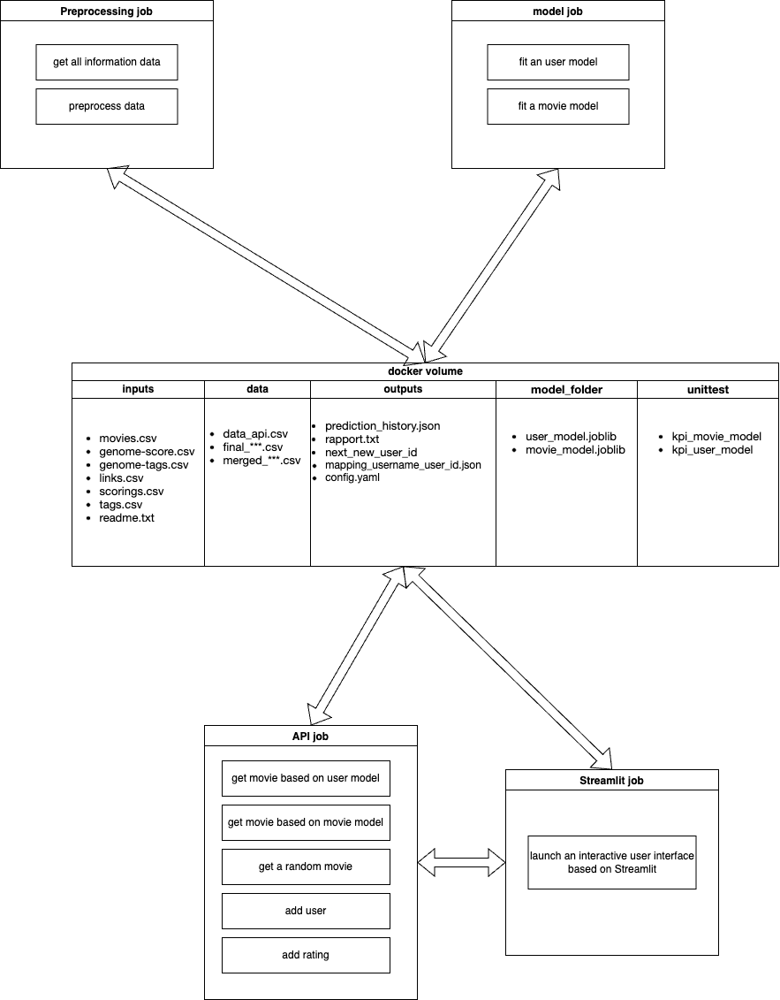

# Movie Recommendation System

## Project Overview

This project aims to implement a movie recommendation system using various preprocessing steps, model building, and creating a user interface.
This project implements a movie and a user recommendation system using collaborative filtering. The system is designed to suggest movies to users based on their historical movie ratings and similarities with other users.
Recommender systems are built on MovieLens dataset with 100,000 movie ratings. These Recommender systems were built using Pandas operations and by fitting KNN to suggest movies for the users based on similar users.


## Table of Contents

- [Introduction](#introduction)
- [Requirements](#requirements)
- [Installation](#installation)
- [Architecture](#architecture)
- [Usage](#usage)
- [Data Preparation](#data-preparation)
- [Model Training](#model-training)
- [Movie Recommendations](#movie-recommendations)
- [Evaluation](#evaluation)
- [Stability Analysis](#stability-analysis)
- [Prediction Comparison](#prediction-comparison)
- [API Usage](#api-usage)
- [License](#license)

## Introduction

This recommendation system leverages collaborative filtering, a popular approach in recommender systems, to provide personalized movie suggestions to users. Collaborative filtering works by identifying users who have similar movie preferences and recommending movies that these similar users have rated highly.

## Requirements

- Python 3.x
- pandas
- numpy
- scipy
- scikit-learn
- joblib
- fastapi
- uvicorn[standard]

## Installation

1. Clone the repository:
```
git clone https://github.com/mlops-recofilm/recofilm.git
cd recofilm
```

## Architecture 

```
.
├── Images
│   └── reco_diagram.png
├── __init__.py
├── api
│   ├── Dockerfile
│   ├── __init__.py
│   ├── api.py
│   ├── api_requirements.txt
│   └── api_utils
│       ├── __init__.py
│       └── utils.py
├── docker-compose.yml
├── docker_volume
│   ├── data
│   │   ├── data_api.csv
│   │   ├── final_False_0.3_50_5_False.csv
│   │   └── merged_False_0.3_50_5_False.csv
│   ├── inputs
│   │   ├── README.txt
│   │   ├── genome-scores.csv
│   │   ├── genome-tags.csv
│   │   ├── links.csv
│   │   ├── movies.csv
│   │   ├── ratings.csv
│   │   └── tags.csv
│   ├── model_folder
│   │   ├── movie_model.joblib
│   │   └── user_model.joblib
│   ├── next_new_userid
│   └── outputs
│       ├── mapping_usernam_user_id.json
│       ├── predictions_history.json
│       └── rapport.txt
├── model_job
│   ├── Dockerfile
│   ├── __init__.py
│   ├── model
│   │   ├── __init__.py
│   │   ├── movie_model.py
│   │   ├── user_model.py
│   │   └── utils.py
│   ├── model_requirements.txt
│   ├── model_utils.py
│   └── training_pipeline.py
├── preprocessing_job
│   ├── Dockerfile
│   ├── __init__.py
│   ├── check_data.py
│   ├── create_data.py
│   ├── main.py
│   └── preprocessing_requirements.txt
├── readme.md
├── requirements.txt
├── streamlit_job
│   ├── Dockerfile
│   ├── __init__.py
│   ├── config.yaml
│   ├── dashboard.py
│   └── streamlit_requierements.txt
└── utils
    ├── __init__.py
    ├── path.py
    └── utils.py

15 directories, 53 files

```


### Folder Descriptions

- `Images`: Contains images and diagrams used in documentation.
- `api`: Holds code and resources for the recommendation API.
- `docker_volume`: Directory used to store data, models, and generated outputs.
- `model_job`: Implements the construction and training of recommendation models.
- `preprocessing_job`: Performs preprocessing on raw data before model training.
- `streamlit_job`: Creates a Streamlit-based user interface for interaction with recommendations.
- `utils`: Contains shared utilities used throughout the project.

### Docker Configuration

The `docker-compose.yml` file helps manage the execution of different project parts and connects services together.

### How to Use

1. **Data Preprocessing** (`preprocessing_job`):
   - Run `preprocessing_job/main.py` to perform preprocessing on raw data.

2. **Model Building** (`model_job`):
   - Build and train recommendation models by running `model_job/training_pipeline.py`.

3. **Recommendation API** (`api`):
   - The recommendation API can be run using `api/api.py`, providing endpoints to get movie recommendations.

4. **User Interface** (`streamlit_job`):
   - Run `streamlit_job/dashboard.py` to launch an interactive user interface based on Streamlit.

### Important Notes

- Make sure to have the necessary dependencies installed for each project part using `requirements.txt` or `*_requirements.txt` files.
- The entire project is set up to be run within Docker containers. Make sure to have Docker installed on your system.
- Customize and adjust paths and configurations as per your project's requirements.


## Model 

### Usage

1. Load the movie ratings data into a pandas DataFrame. The data should contain at least the following columns: 'movieId', 'rating', and 'userId'.

2. Instantiate the `MovieModel` class.

3. Prepare the data using the `prepare_data` method.

4. Fit the model using the `fit` method with the DataFrame and the number of neighbors to consider for recommendation.

5. Generate movie recommendations using the `predict` method by providing a movie title, the number of recommendations to generate, and a dictionary mapping movie titles to their corresponding movie IDs.

6. Optionally, evaluate the model's recommendations using the `evaluate` method.

### Data Preparation

Before using the recommendation system, make sure to load and prepare the movie ratings data. The data should be organized in a DataFrame with the following columns:

- 'movieId': The unique identifier of the movie.
- 'rating': The rating given by a user to a movie.
- 'userId': The unique identifier of the user.

You can use the provided functions `split_data_timestamp` or `split_data_random` to split the data into train and test sets for evaluation purposes.

### Model Training

To train the movie recommendation model, follow these steps:

1. Load and prepare the movie ratings data.
2. Instantiate the `MovieModel` class.
3. Use the `prepare_data` method to prepare the data and create a sparse CSR matrix representation.
4. Train the model using the `fit` method with the DataFrame and the number of neighbors to consider for recommendation.

### Movie Recommendations

To generate movie recommendations for a given movie title, use the `predict` method. Provide the movie title, the number of recommendations to generate, and a dictionary mapping movie titles to their corresponding movie IDs.

### Evaluation

To evaluate the model's recommendations, you can use the `evaluate` method. Provide the movie title, the number of recommendations to generate, and a dictionary mapping movie titles to their corresponding movie IDs. The method will calculate the average rating of recommended movies and return a list of recommended movie titles.

### Stability Analysis

The `stability` method allows you to assess the stability of the recommendations for a given movie. It generates recommendations multiple times (100 times in this implementation) and calculates the stability of each movie based on how frequently it appears in the recommendations.

### Prediction Comparison

The `prediction_comparison` method enables you to compare movie recommendations for multiple movie titles. Provide a list of movie titles, the number of recommendations to generate for each movie title, and a dictionary mapping movie titles to their corresponding movie IDs.

## API Usage

The project also includes a FastAPI-based API for movie recommendations. The API provides endpoints for users to get movie recommendations, add movie ratings, create new users, and more. The API is designed to interact with the trained movie recommendation model and facilitate real-time movie recommendations.

To run the API, use the following command:
```
uvicorn app:app --reload
```
The API documentation will be available at `http://127.0.0.1:8000/docs`.

## License

This project is licensed under the MIT License. See the [LICENSE](LICENSE) file for details.

